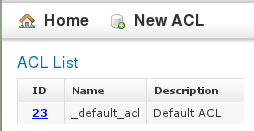
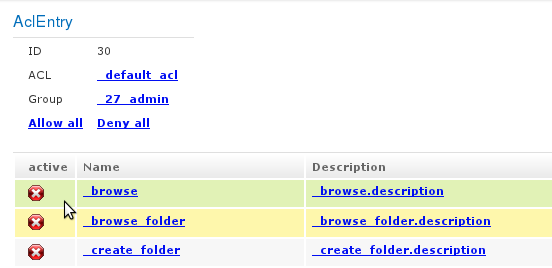
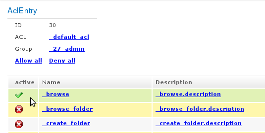

# ACLs (Access Control List) in Cinnamon
## Overview
Access to content in a Cinnamon repository is regulated by ACLs. 
An ACL is basically a list of permissions of things a user groups is allowed to do with a resource.
For example, an ACL may assign the permission "write object content" to the group 'authors' and the permission "change object metadata" to the group 'editors'.

So, an ACL consists of a label, for example 'documentation acl' to which are assigned one or more groups.
Each groups gets its own list of permissions for this ACL. The current set of permissions is:

* browse: permission to browse an object and view it's metadata like name, owner, creation date and so on. If you do not have browse permission on an object, it will be hidden from you by the server.
* browse_folder: permission to see the content of a folder (which may consist of objects and more folders). Without browse_folder permission, a user may not see the content of a folder. Note that the user may have access to subfolders of a forbidden folder, for example: John may not be allowed to see the content of the /home folder, but the ACL on /home/john may have a more permissive ACL.
* create_folder: permission to create a folder inside a folder, for example adding /home/john/manual to /home/john.
* create_inside_folder: permission to create objects inside a folder.
* create_instance:  Permission to create an instance of a template object of some kind. Current use case is for workflow templates. If you have a create_instance permission on a workflow template, you may call create_workflow to instantiate a new workflow.
* delete_folder: permission to delete a folder
* delete_object: permission to delete an object.
* edit_folder: permission to change a folder's name, owner and so on.
* lock: permission to place a lock on an object. This prevents other users from editing the object's content. Currently it does not prevent them from changing the object's metadata (like the name)
* move: permission to move an object or folder into another folder.
* query_custom_table: permission to execute queries against custom tables. This is only used by Cinnamon extensions, if at all.
* read_object_content: permission to read an object's content
* read_object_custom_metadata: permission to read an object's custom metadata. 
* read_object_sysmeta: permission to read an object's or folder's system metadata (like the name, owner etc)
* set_acl: permission to set the ACL of an object or folder. Note that this permission should be only given to administrators, to prevent users from changing a restrictive ACL to an permissive one and making unauthorized changes.
* version: permission to create a new version of an object.
* write_object_content: permission to set an object's content.
* write_object_custom_metadata: This permission is required to store application dependent information about an object. The decision when to use separate objects and when to use custom metadata is up to the application designer. For example, if you have a technical manual and during the workflow towards a finished document the application collects notes from several editors about the content, the program may either store them in the custom metadata as XML nodes - or create elements linked by relations to the manual. If the data is specific to this one manual, it will probably be best to use the custom metadata, as this makes indexing and searching the notes easier.
* write_object_sysmeta: permission to write an object's system metadata (name, owner, format, object type etc)

### Extended permissions

Note that there is no mechanism to "forbid" an action, you can only assign positive permissions like "write permission", not "forbidden to write". This is a whitelisting approach. Since a user may be a member of several groups, he may gain the permission to access an object from any of them.
For example, if Alice is a member of the author's and the editor's group, and the editor's group is allowed to change an object's system metadata (and thus the lifecycle of an object), the lack of a "write_object_metadata" permission in the author's group will not prevent her from exercising her editor-permissions. 

There are three special groups which have dynamic / special memberships:
* _superusers: members of this group are completely exempt from permission checks (access to objects may be logged). Membership in this group should be restricted to system administrators (who probably have direct access to the database anyway).
* _owner: A user is a member of the owner group if he is the owner of the current object he wants to access.
* _everyone: granting a permission to the everyone group will grant it to all authenticated users.

## How to add a permission to an object's ACL

On the start page of the administration area, click on "ACLs"

From the ACL list view, choose an ACL and click on its id.

On the selected ACL's page, select the group whose permissions on the ACL you want to change.
To assign a permission to an individual user, use his personal group.

Click the 'go to AclEntry' button. (An AclEntry is the combination of an ACL and a user group)

From the ACL Entry's list, choose the permission you want to assign and click on the corresponsing icon in the "active" column.

Clickng on the icon will toggle between the "permission granted" and "permission not granted" states. 

